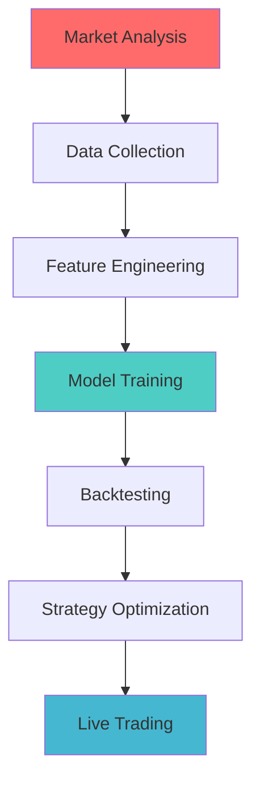

# 👋 Hey there! I'm nikonych

<div align="center">
  
</div>

## 🚀 About Me

```python
class Developer:
    def __init__(self):
        self.username = "nikonych"
        self.current_status = "🌴 On vacation (but still coding!)"
        self.interests = [
            "cryptocurrency prediction", 
            "web scraping", 
            "data analysis",
            "machine learning"
        ]
        self.current_focus = "Building predictive models for crypto markets"
    
    def say_hi(self):
        print("Thanks for dropping by! Let's build something amazing together 🚀")

me = Developer()
me.say_hi()
```

## 🛠️ Tech Stack

<div align="center">

### Languages


### Data Science & ML


### Tools & Technologies


</div>

## 🎯 Featured Projects

### 📈 [Crypto Prediction](https://github.com/nikonych/crypto_prediction)
> 🤖 Machine learning models for cryptocurrency price prediction using advanced algorithms and data analysis

**Key Features:**
- Real-time market data analysis
- Predictive modeling with multiple algorithms
- Risk assessment and trading signals
- Interactive Jupyter notebooks

### 🕷️ [Web Scraping with Java](https://github.com/nikonych/Web-Scraping_mit_Java)
> ⚡ High-performance web scraping solution built with Java for efficient data extraction

**Highlights:**
- Multi-threaded scraping architecture
- Robust error handling and retry mechanisms
- Data cleaning and preprocessing pipelines
- Scalable and maintainable codebase

## 📊 GitHub Stats

<div align="center">
  
  
</div>

<div align="center">
  
</div>

## 🌟 Current Focus



## 💡 Fun Facts

- 🎯 Currently exploring the intersection of AI and financial markets
- 🌊 Love combining technical analysis with machine learning
- 🚀 Always excited about new technologies and frameworks
- 🌴 Believe in work-life balance (hence the vacation status!)

## 📫 Let's Connect!

<div align="center">

[](https://github.com/nikonych)
[](#)
[](#)

</div>

---

<div align="center">
  
  
  **"Code is like humor. When you have to explain it, it's bad."** 💭
</div>

<div align="center">
  
  ⭐ From [nikonych](https://github.com/nikonych) | Made with ❤️ and lots of ☕
  
</div>
